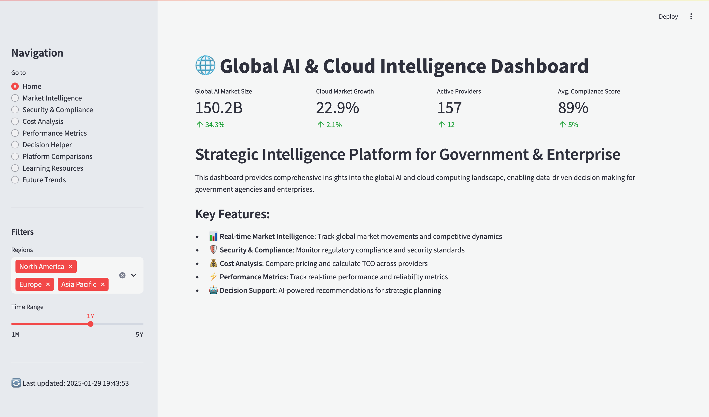
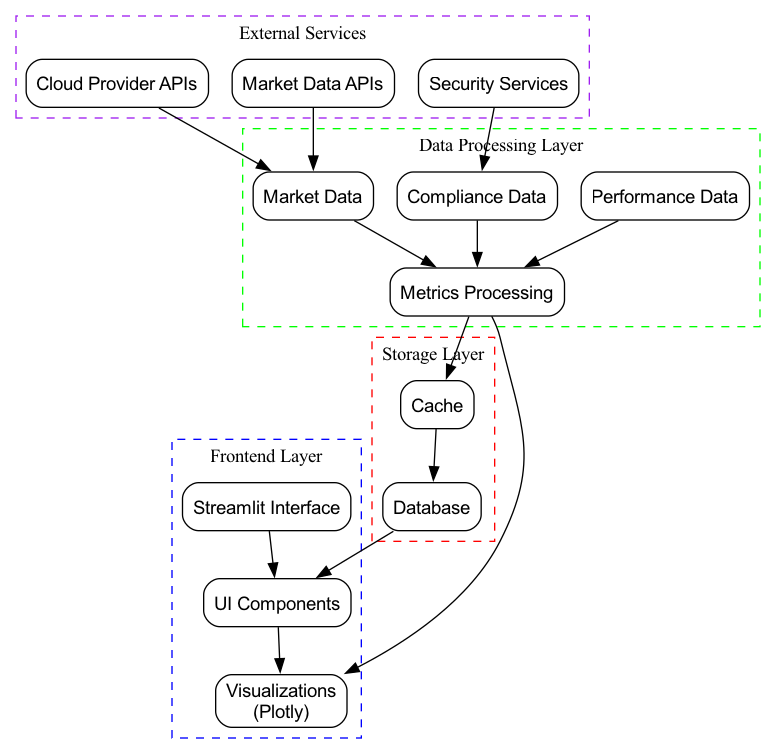
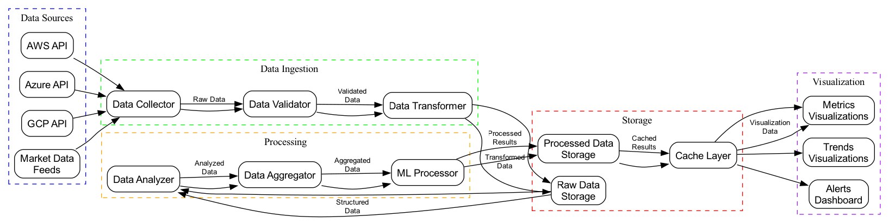
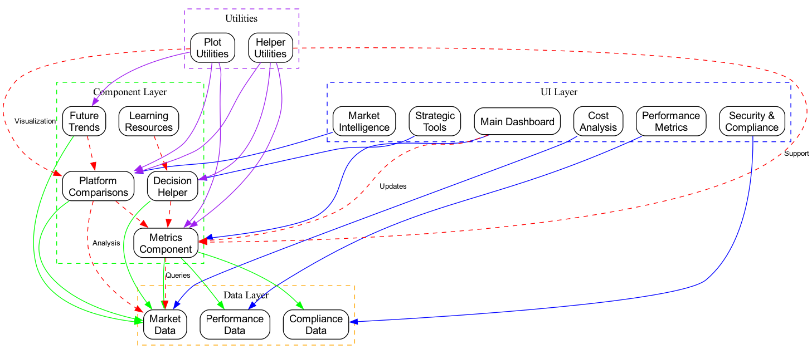
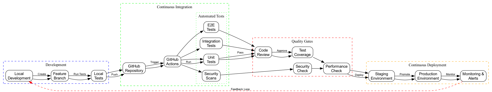

# Global AI & Cloud Intelligence Dashboard 🌐

A comprehensive real-time analytics platform for monitoring and analyzing the global AI and cloud computing landscape. This enterprise-grade dashboard provides strategic intelligence for decision-makers, offering deep insights into market trends, performance metrics, and competitive analysis.



## 🚀 Key Features

- **Market Intelligence**
  - Real-time market share analysis
  - Growth trend visualization
  - Regional market dynamics
  - Competitive landscape analysis

- **Security & Compliance**
  - Compliance requirement tracking
  - Security score monitoring
  - Certification timeline management
  - Data residency visualization

- **Cost Analysis**
  - Total Cost of Ownership (TCO) calculator
  - Provider cost comparisons
  - Budget optimization tools
  - Resource utilization tracking

- **Performance Metrics**
  - Real-time performance monitoring
  - Global latency analysis
  - SLA compliance tracking
  - Resource efficiency metrics

- **Strategic Tools**
  - AI-powered decision support
  - Platform comparison matrix
  - Learning resource center
  - Future trends forecasting

## 🛠️ Technology Stack

- **Frontend**: Streamlit
- **Data Processing**: Python, Pandas, NumPy
- **Visualization**: Plotly
- **Architecture**: Component-based, Modular Design

## 📊 Dashboard Architecture

```
.
├── src/
│   ├── app.py                 # Main application entry point
│   ├── components/            # Reusable UI components
│   │   ├── metrics.py
│   │   ├── decision_helper.py
│   │   ├── platform_comparisons.py
│   │   ├── learning_resources.py
│   │   └── future_trends.py
│   ├── data/                 # Data processing modules
│   │   ├── market_data.py
│   │   ├── compliance_data.py
│   │   └── performance_data.py
│   ├── utils/                # Helper functions
│   │   └── helpers.py
│   └── visualizations/       # Visualization components
│       ├── plots.py
│       ├── compliance_plots.py
│       └── performance_plots.py
└── requirements.txt          # Project dependencies
```

## 📐 Architecture Diagrams

The following diagrams provide visual representations of the system's architecture and workflows:

To generate the architecture diagrams:

1. Install Graphviz:
   ```bash
   # macOS
   brew install graphviz
   
   # Ubuntu/Debian
   sudo apt-get install graphviz
   
   # Windows (using Chocolatey)
   choco install graphviz
   ```

2. Run the diagram generation script:
   ```bash
   ./scripts/generate_diagrams.sh
   ```

### System Architecture

Shows the overall system architecture including frontend, data processing, storage, and external services layers.

### Data Flow

Illustrates how data moves through the system from ingestion to visualization.

### Component Interactions

Maps out how different components communicate and depend on each other.

### Deployment Pipeline

Visualizes the complete CI/CD workflow from development to production.

Note: The source files for these diagrams are available in DOT format under `docs/diagrams/`. You can modify them and regenerate the images using the script above.

## 🚀 Getting Started

1. Clone the repository:
   ```bash
   git clone https://github.com/dbsectrainer/ai-cloud-dashboard.git
   cd ai-cloud-dashboard
   ```

2. Install dependencies:
   ```bash
   pip install -r requirements.txt
   ```

3. Run the dashboard:
   ```bash
   streamlit run src/app.py
   ```

## 📈 Performance & Scalability

- Real-time data processing capabilities
- Efficient data structure optimization
- Responsive design for various screen sizes
- Modular architecture for easy scaling

## 🔒 Security & Compliance

- Data encryption in transit and at rest
- Compliance with industry standards
- Regular security updates
- Comprehensive audit logging

## 🌟 Use Cases

1. **Enterprise Decision Making**
   - Cloud provider selection
   - Cost optimization strategies
   - Security compliance planning
   - Technology stack evaluation

2. **Market Analysis**
   - Competitive intelligence
   - Market trend identification
   - Regional market analysis
   - Growth opportunity assessment

3. **Strategic Planning**
   - Technology roadmap development
   - Risk assessment
   - Investment planning
   - Vendor evaluation

## 📚 Additional Resources

- [Comprehensive Whitepaper](Global_Cloud_AI_Strategy_2025.md)
- [Technical Documentation](docs/)
- [API Reference](api-docs/)
- [Contributing Guidelines](CONTRIBUTING.md)

## 🤝 Contributing

Contributions are welcome! Please read our [Contributing Guidelines](CONTRIBUTING.md) for details on how to submit pull requests, report issues, and contribute to the project.

## 📄 License

This project is licensed under the MIT License - see the [LICENSE](LICENSE) file for details.

## 🏆 Recognition

- Featured in Cloud Computing Monthly
- Top Rated Dashboard on Streamlit Gallery
- Enterprise Architecture Excellence Award

## 👥 Maintainers

- [Your Name](https://github.com/dbsectrainer)

## 📬 Contact

- GitHub: [@yourusername](https://github.com/dbsectrainer)
- LinkedIn: [Your LinkedIn](https://www.linkedin.com/in/donnivis-baker-cissp-pmp/)


---

*Built with ❤️ for the cloud computing community*
