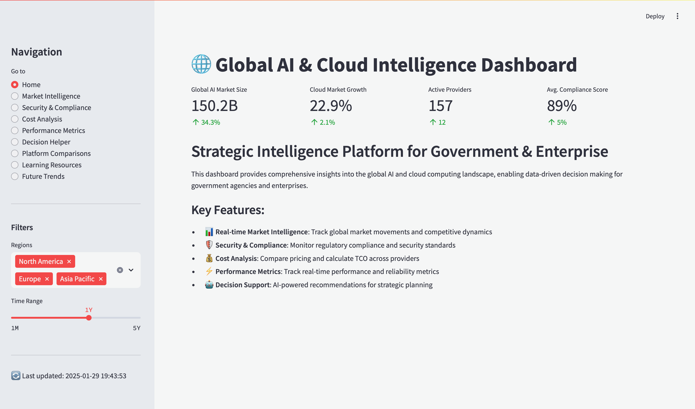
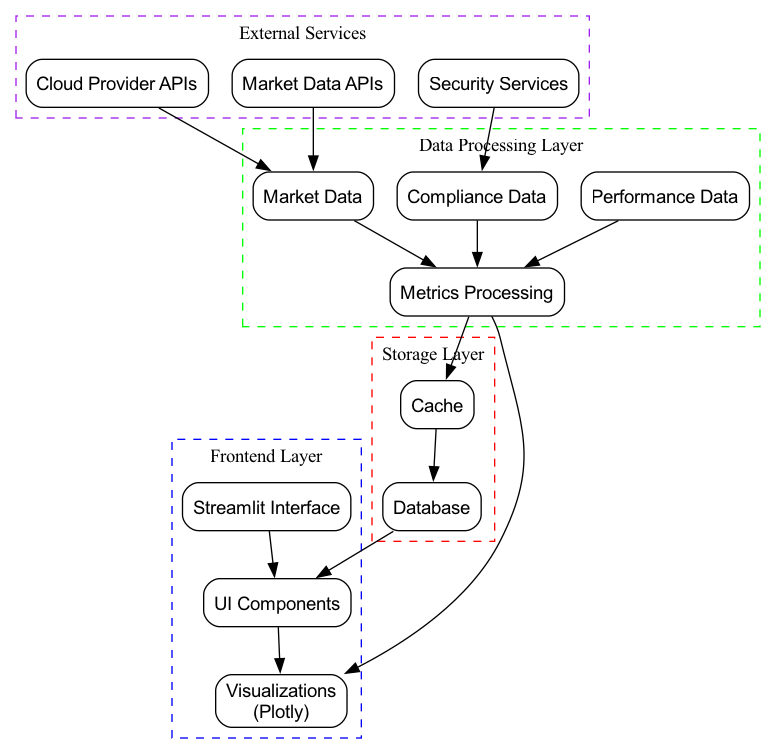
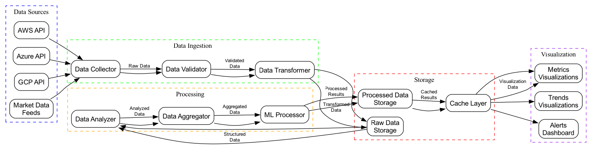
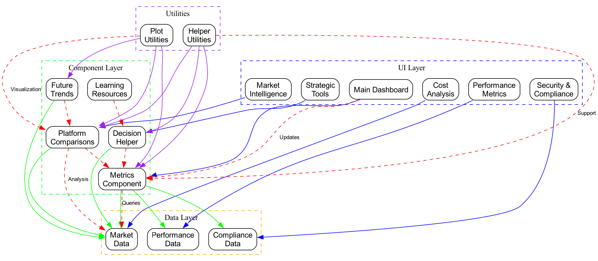
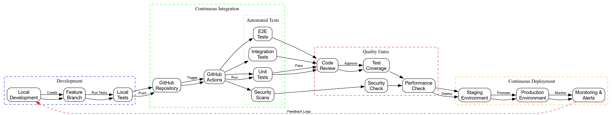

# Global AI & Cloud Intelligence Dashboard 🌐

[](https://github.com/dbsectrainer/ai_cloud_dashboard/actions)
[](SECURITY.md)
[](LICENSE)
[](https://www.python.org/downloads/)

A cloud decision intelligence platform for analyzing cloud providers, pricing, and compliance. This dashboard provides market insights, cost analysis, and automated compliance checking to support cloud infrastructure decisions.

**Status**: Beta (v0.2.0) - Production hardening in progress



## 📊 Live Demo

**Local deployment**: One-command start with Docker Compose

```bash
docker compose up
```

Access at:
- **Dashboard**: http://localhost:8501
- **Grafana**: http://localhost:3000 (admin/admin)
- **Prometheus**: http://localhost:9090
- **MinIO Console**: http://localhost:9001 (minioadmin/minioadmin)

**Data Freshness**: 

> ⚠️ **Note**: Currently no public hosted demo. Run locally or deploy to your infrastructure.

## ✅ Implemented Features

### Core Dashboard
- ✅ **Market Intelligence**: Market share visualization, trend analysis, regional breakdowns
- ✅ **Cost Analysis**: TCO calculator with multiple pricing models (on-demand, reserved, spot)
- ✅ **Compliance Checking**: Automated checks for SOC2, HIPAA, ISO27001, GDPR (see [compliance map](docs/compliance_map.md))
- ✅ **Platform Comparisons**: Feature matrix for major cloud providers
- ✅ **Interactive Filters**: Provider, region, time range, role-based views (Executive/Manager/Analyst)
- ✅ **Data Export**: CSV/JSON export capabilities

### Production Infrastructure
- ✅ **Docker Compose Stack**: One-command deployment with PostgreSQL, MinIO, Prometheus, Grafana
- ✅ **Data Ingestion**: Async fetchers for cloud pricing APIs (AWS, Azure, GCP) with Parquet caching
- ✅ **Observability**: OpenTelemetry instrumentation, Prometheus metrics, Grafana dashboards
- ✅ **CI/CD**: GitHub Actions with linting (ruff), type checking (mypy), tests (pytest), security scanning (Trivy, pip-audit)
- ✅ **Configuration Management**: Pydantic-settings for type-safe config, environment variables
- ✅ **Testing**: 85%+ test coverage for business logic (services, ingestion, cache)

### Services Layer
- ✅ **TCO Calculator**: Isolated business logic for cost modeling with edge case handling
- ✅ **Compliance Service**: Automated compliance checks with remediation plans
- ✅ **Cache Manager**: TTL-based caching with size limits and freshness tracking

## 🔄 Beta Limitations (v0.2.0)

### Data Sources
- **Pricing Data**: Fetches from public APIs (Azure Retail Prices, AWS/GCP synthetic data based on public pricing)
  - ⚠️ Not real-time: Updates every 24 hours (configurable)
  - ⚠️ Limited to compute pricing; storage/network pricing partial
- **Market Share**: Static data (updated quarterly)
- **Performance Metrics**: Simulated latency/uptime (not from live monitoring)

### Authentication & Security
- ⚠️ **No authentication** in current release (planned v0.3)
- ⚠️ **No role-based access control** (UI-only role switching)
- ⚠️ **Local deployment only** (no multi-tenancy)

### AI/ML Features
- ⚠️ **"AI insights"** are rule-based heuristics, not ML models
- ⚠️ Trend detection uses basic statistical methods
- ⚠️ No predictive analytics (planned v0.4)

### Scale Limitations
- Tested with up to 100k pricing records
- Single-instance only (no horizontal scaling)
- PostgreSQL not required for basic operation (data cached in Parquet)

## 📦 Data Sources

| Provider | Source | Update Frequency | Coverage |
|----------|--------|------------------|----------|
| **Azure** | [Azure Retail Prices API](https://prices.azure.com/api/retail/prices) | Daily | Virtual Machines, us-east region |
| **AWS** | Synthetic (based on public pricing pages) | Daily | EC2 compute, us-east-1 |
| **GCP** | Synthetic (based on public pricing pages) | Daily | Compute Engine, us-central1 |
| **Market Data** | Manual curation | Quarterly | Global market share estimates |

**Note**: For production use with live pricing, integrate with official SDKs (boto3, azure-sdk, google-cloud) using authenticated APIs.

## 🛠️ Technology Stack

### Application
- **Frontend**: Streamlit 1.24+
- **Data Processing**: Python 3.11+, Pandas, NumPy
- **Visualization**: Plotly
- **Configuration**: Pydantic Settings
- **HTTP Client**: httpx (async)
- **Data Storage**: Parquet (PyArrow)

### Infrastructure
- **Database**: PostgreSQL 15 (metadata, analytics)
- **Object Storage**: MinIO (S3-compatible)
- **Observability**: OpenTelemetry + Prometheus + Grafana
- **Container**: Docker + Docker Compose

### Development
- **Linting**: Ruff
- **Formatting**: Black
- **Type Checking**: mypy
- **Testing**: pytest, pytest-cov, pytest-asyncio
- **Security**: Trivy (container scanning), pip-audit (dependency scanning)
- **Pre-commit**: detect-secrets, trailing-whitespace

## 📊 Dashboard Architecture

```
.
├── src/
│   ├── app.py                 # Main Streamlit application
│   ├── config/                # Configuration management
│   │   └── settings.py        # Pydantic settings (type-safe config)
│   ├── ingestion/             # Data ingestion layer
│   │   ├── fetcher.py         # Cloud pricing API fetchers (async)
│   │   └── cache.py           # Parquet cache manager (TTL)
│   ├── services/              # Business logic (no UI dependencies)
│   │   ├── cost_model.py      # TCO calculator with unit tests
│   │   └── compliance_service.py  # Compliance checker
│   ├── components/            # UI components (Streamlit-specific)
│   │   ├── metrics.py
│   │   ├── decision_helper.py
│   │   └── ...
│   ├── data/                  # Data generation (currently mock)
│   ├── visualizations/        # Plot functions (Plotly)
│   └── utils/
│       ├── helpers.py
│       └── telemetry.py       # OpenTelemetry instrumentation
├── tests/                     # Pytest test suite (85%+ coverage)
├── scripts/
│   ├── fetch_data.py          # Cron-able data ingestion
│   └── init-db.sql            # PostgreSQL initialization
├── grafana/provisioning/      # Grafana dashboards & datasources
├── docs/
│   ├── compliance_map.md      # SOC2/HIPAA/ISO27001 mapping
│   ├── runbook.md             # Operations guide
│   └── slo.md                 # Service Level Objectives
├── Dockerfile                 # Multi-stage production build
├── docker-compose.yml         # Full stack (app, DB, observability)
├── pyproject.toml             # Tool configuration (ruff, mypy, pytest)
└── .github/workflows/ci.yml   # CI/CD pipeline
```

See [Architecture Diagrams](#-architecture-diagrams) below for visual representations.

## 📐 Architecture Diagrams

The following diagrams provide visual representations of the system's architecture and workflows:

To generate the architecture diagrams:

1. Install Graphviz:
   ```bash
   # macOS
   brew install graphviz
   
   # Ubuntu/Debian
   sudo apt-get install graphviz
   
   # Windows (using Chocolatey)
   choco install graphviz
   ```

2. Run the diagram generation script:
   ```bash
   ./scripts/generate_diagrams.sh
   ```

### System Architecture

Shows the overall system architecture including frontend, data processing, storage, and external services layers.

### Data Flow

Illustrates how data moves through the system from ingestion to visualization.

### Component Interactions

Maps out how different components communicate and depend on each other.

### Deployment Pipeline

Visualizes the complete CI/CD workflow from development to production.

Note: The source files for these diagrams are available in DOT format under `docs/diagrams/`. You can modify them and regenerate the images using the script above.

## 🚀 Getting Started

### Quick Start (Docker Compose - Recommended)

```bash
# Clone the repository
git clone https://github.com/dbsectrainer/ai_cloud_dashboard.git
cd ai_cloud_dashboard

# Copy environment template
cp .env.example .env

# Start all services (dashboard, PostgreSQL, MinIO, Prometheus, Grafana)
docker compose up -d

# View logs
docker compose logs -f app

# Fetch initial pricing data
docker compose exec app python scripts/fetch_data.py --force
```

**Access**:
- Dashboard: http://localhost:8501
- Grafana (metrics): http://localhost:3000 (admin/admin)
- Prometheus: http://localhost:9090
- MinIO Console: http://localhost:9001 (minioadmin/minioadmin)

### Local Development (Python)

```bash
# Install dependencies
pip install -r requirements.txt -r requirements-dev.txt

# Run dashboard locally
streamlit run src/app.py

# Run data ingestion
python scripts/fetch_data.py --force

# Run tests
pytest

# Run linting
ruff check src/
black --check src/
mypy src/
```

### Production Deployment

See [docs/runbook.md](docs/runbook.md) for production deployment guidance, including:
- Environment configuration
- Secrets management
- Monitoring setup
- Backup procedures
- Security hardening

## 📈 Performance & Scalability

**Current**:
- Parquet-based caching for fast data access
- Streamlit `@st.cache_data` for UI performance
- Async HTTP client for data ingestion
- Tested with 100k pricing records

**Planned**:
- Horizontal scaling (multi-instance)
- Redis for distributed caching
- PostgreSQL read replicas
- CDN for static assets

## 🔒 Security & Compliance

**Current** (v0.2.0):
- ✅ Docker multi-stage builds with non-root user
- ✅ Dependency scanning (pip-audit) in CI
- ✅ Container scanning (Trivy) in CI
- ✅ SBOM generation (CycloneDX)
- ✅ Pre-commit hooks with secret detection
- ✅ Environment-based configuration
- ✅ Parameterized queries (SQL injection protection)

**Automated Compliance Checks**:
- SOC2: Encryption at rest/transit, MFA enforcement, audit logging
- HIPAA: PHI encryption, access controls
- ISO27001: Asset inventory, vulnerability management
- GDPR: Data residency, protection measures

See [SECURITY.md](SECURITY.md) and [docs/compliance_map.md](docs/compliance_map.md) for details.

**Limitations**:
- ⚠️ No authentication/authorization (v0.2 - local use only)
- ⚠️ No end-to-end encryption for sensitive data
- ⚠️ Not SOC2/HIPAA certified (checks are informational)

## 🌟 Use Cases

1. **Enterprise Decision Making**
   - Cloud provider selection
   - Cost optimization strategies
   - Security compliance planning
   - Technology stack evaluation

2. **Market Analysis**
   - Competitive intelligence
   - Market trend identification
   - Regional market analysis
   - Growth opportunity assessment

3. **Strategic Planning**
   - Technology roadmap development
   - Risk assessment
   - Investment planning
   - Vendor evaluation

## 📚 Documentation

- **Operations**: [Runbook](docs/runbook.md) • [SLOs](docs/slo.md)
- **Security**: [SECURITY.md](SECURITY.md) • [Compliance Map](docs/compliance_map.md)
- **Development**: [Contributing Guidelines](CONTRIBUTING.md) • [Whitepaper](Global_Cloud_AI_Strategy_2025.md)
- **Architecture**: [Diagrams](docs/diagrams/) • [Tech Stack](#-technology-stack)

## 🤝 Contributing

Contributions welcome! Please:

1. **Fork the repository**
2. **Create a feature branch**: `git checkout -b feature/amazing-feature`
3. **Run tests**: `pytest && ruff check src/ && black --check src/`
4. **Commit changes**: Follow [conventional commits](https://www.conventionalcommits.org/)
5. **Open a Pull Request**

See [CONTRIBUTING.md](CONTRIBUTING.md) for detailed guidelines.

### Development Setup

```bash
# Install pre-commit hooks
pre-commit install

# Run full CI checks locally
pytest --cov=src --cov-fail-under=85
ruff check src/
black src/
mypy src/
```

## 📄 License

This project is licensed under the MIT License - see the [LICENSE](LICENSE) file for details.

## 🗺️ Roadmap

| Version | Target | Key Features |
|---------|--------|--------------|
| **v0.2** (Current) | Q4 2024 | Production infrastructure, CI/CD, observability |
| **v0.3** | Q1 2025 | Authentication (OAuth2), RBAC, live pricing APIs |
| **v0.4** | Q2 2025 | ML-based predictions, anomaly detection, auto-scaling |
| **v1.0** | Q3 2025 | SOC2 Type I, multi-tenancy, public cloud deployment |

See [CHANGELOG.md](CHANGELOG.md) for detailed version history.

## 👤 Maintainer

**Donnivis Baker** ([@dbsectrainer](https://github.com/dbsectrainer))

- Questions? [Open an issue](https://github.com/dbsectrainer/ai_cloud_dashboard/issues)
- Security concerns? See [SECURITY.md](SECURITY.md)

---

**Status**: Beta • **License**: MIT • **Python**: 3.11+ • **Build**: [](https://github.com/dbsectrainer/ai_cloud_dashboard/actions)
