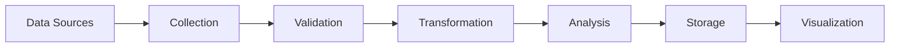

# Data Processing Guide

This guide explains the data processing pipeline and methodologies used in the AI Cloud Dashboard.

## Data Pipeline Overview



## Data Sources

### Cloud Provider APIs
- AWS CloudWatch
- Azure Monitor
- Google Cloud Monitoring
- Custom API integrations

### Market Data
- Provider market share
- Industry trends
- Competitive analysis
- Growth metrics

### Performance Metrics
- Resource utilization
- Response times
- Error rates
- Availability metrics

## Data Collection

### Real-time Collection
```python
from src.data.collectors import DataCollector

class RealTimeCollector(DataCollector):
    async def collect_metrics(self):
        """Collect real-time metrics from cloud providers"""
        metrics = {}
        for provider in self.providers:
            metrics[provider] = await self.fetch_provider_metrics(provider)
        return metrics

    async def fetch_provider_metrics(self, provider):
        """Fetch metrics from specific provider"""
        client = self.get_provider_client(provider)
        return await client.get_metrics(self.metric_definitions)
```

### Batch Collection
```python
class BatchCollector(DataCollector):
    def collect_historical_data(self, timeframe):
        """Collect historical data for analysis"""
        data = {}
        for source in self.data_sources:
            data[source] = self.fetch_historical_data(source, timeframe)
        return data
```

## Data Validation

### Schema Validation
```python
from pydantic import BaseModel

class MetricData(BaseModel):
    timestamp: datetime
    value: float
    unit: str
    source: str
    metadata: Dict[str, Any]

def validate_metric_data(data: Dict) -> MetricData:
    """Validate metric data against schema"""
    return MetricData(**data)
```

### Data Quality Checks
```python
class DataQualityChecker:
    def check_data_quality(self, data):
        """Perform data quality checks"""
        checks = [
            self.check_completeness(data),
            self.check_accuracy(data),
            self.check_consistency(data),
            self.check_timeliness(data)
        ]
        return all(checks)
```

## Data Transformation

### Normalization
```python
class DataNormalizer:
    def normalize_metrics(self, data):
        """Normalize metrics to common format"""
        normalized = {}
        for provider, metrics in data.items():
            normalized[provider] = self.standardize_format(metrics)
        return normalized

    def standardize_format(self, metrics):
        """Convert provider-specific format to standard format"""
        return {
            'timestamp': metrics['time'],
            'value': float(metrics['value']),
            'unit': self.convert_units(metrics['unit']),
            'metadata': self.extract_metadata(metrics)
        }
```

### Aggregation
```python
class DataAggregator:
    def aggregate_metrics(self, data, window='1h'):
        """Aggregate metrics over time window"""
        return data.groupby(
            pd.Grouper(freq=window)
        ).agg({
            'value': ['mean', 'min', 'max', 'std'],
            'count': 'sum'
        })
```

## Data Analysis

### Statistical Analysis
```python
class MetricsAnalyzer:
    def analyze_trends(self, data):
        """Analyze metric trends"""
        return {
            'mean': data['value'].mean(),
            'median': data['value'].median(),
            'std_dev': data['value'].std(),
            'trend': self.calculate_trend(data)
        }

    def calculate_trend(self, data):
        """Calculate trend direction and strength"""
        x = np.arange(len(data))
        y = data['value'].values
        slope, _ = np.polyfit(x, y, 1)
        return {
            'direction': 'up' if slope > 0 else 'down',
            'strength': abs(slope)
        }
```

### Machine Learning Models
```python
class MLPredictor:
    def train_model(self, historical_data):
        """Train prediction model"""
        X, y = self.prepare_training_data(historical_data)
        self.model.fit(X, y)

    def predict_values(self, current_data):
        """Predict future values"""
        X = self.prepare_prediction_data(current_data)
        return self.model.predict(X)
```

## Data Storage

### Database Schema
```sql
CREATE TABLE metrics (
    id SERIAL PRIMARY KEY,
    timestamp TIMESTAMP NOT NULL,
    provider VARCHAR(50) NOT NULL,
    metric_name VARCHAR(100) NOT NULL,
    value DOUBLE PRECISION NOT NULL,
    unit VARCHAR(20) NOT NULL,
    metadata JSONB
);

CREATE INDEX idx_metrics_timestamp ON metrics(timestamp);
CREATE INDEX idx_metrics_provider ON metrics(provider);
```

### Caching Strategy
```python
class MetricsCache:
    def __init__(self, redis_client):
        self.redis = redis_client
        self.ttl = 3600  # 1 hour

    async def get_cached_metrics(self, key):
        """Get metrics from cache"""
        data = await self.redis.get(key)
        return json.loads(data) if data else None

    async def cache_metrics(self, key, metrics):
        """Cache metrics with TTL"""
        await self.redis.setex(
            key,
            self.ttl,
            json.dumps(metrics)
        )
```

## Performance Optimization

### Batch Processing
```python
class BatchProcessor:
    def process_batch(self, data, batch_size=1000):
        """Process data in batches"""
        batches = [
            data[i:i + batch_size]
            for i in range(0, len(data), batch_size)
        ]
        results = []
        for batch in batches:
            results.extend(self.process_items(batch))
        return results
```

### Parallel Processing
```python
from concurrent.futures import ThreadPoolExecutor

class ParallelProcessor:
    def __init__(self, max_workers=4):
        self.executor = ThreadPoolExecutor(max_workers=max_workers)

    def process_parallel(self, items, processor_func):
        """Process items in parallel"""
        futures = [
            self.executor.submit(processor_func, item)
            for item in items
        ]
        return [f.result() for f in futures]
```

## Error Handling

### Retry Logic
```python
from tenacity import retry, stop_after_attempt, wait_exponential

class DataProcessor:
    @retry(stop=stop_after_attempt(3), wait=wait_exponential())
    async def process_with_retry(self, data):
        """Process data with retry logic"""
        try:
            return await self.process_data(data)
        except Exception as e:
            logger.error(f"Processing failed: {e}")
            raise
```

### Data Recovery
```python
class DataRecovery:
    def recover_data(self, failed_operation):
        """Recover from failed data operation"""
        backup_data = self.load_backup(failed_operation.id)
        if backup_data:
            return self.reprocess_data(backup_data)
        return None
```

## Monitoring and Logging

### Metrics Collection
```python
class ProcessingMetrics:
    def record_metrics(self, operation, duration, status):
        """Record processing metrics"""
        self.metrics_client.gauge(
            f"processing.{operation}.duration",
            duration,
            tags={'status': status}
        )
```

### Logging
```python
import structlog

logger = structlog.get_logger()

class ProcessingLogger:
    def log_operation(self, operation_type, details):
        """Log processing operation"""
        logger.info(
            "data_processing_operation",
            operation_type=operation_type,
            **details
        )
```

## Best Practices

1. **Data Validation**
   - Always validate input data
   - Implement schema validation
   - Check data quality metrics

2. **Error Handling**
   - Implement retry logic
   - Log all errors
   - Maintain data consistency

3. **Performance**
   - Use appropriate batch sizes
   - Implement caching
   - Monitor processing times

4. **Monitoring**
   - Track processing metrics
   - Set up alerts
   - Maintain audit logs

## Additional Resources

- [Data Schema Documentation](schemas.md)
- [API Integration Guide](api-integration.md)
- [Performance Tuning](performance.md)
- [Error Handling Guide](error-handling.md)
