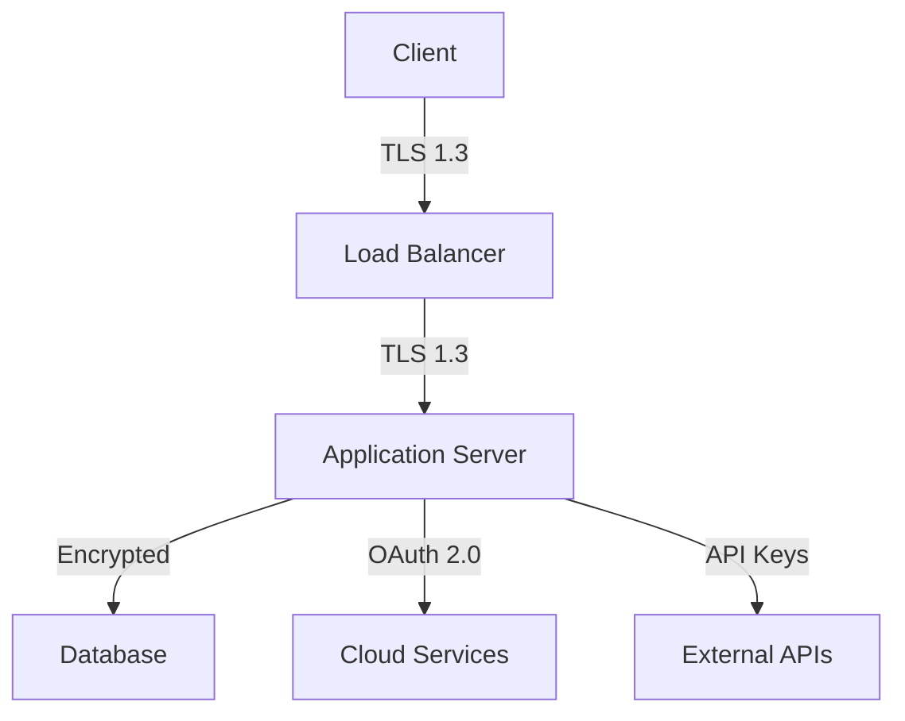

# Security Guide

This guide outlines the security measures and best practices implemented in the AI Cloud Dashboard.

## Security Architecture

### Overview


## Authentication & Authorization

### User Authentication
```python
from src.security.auth import AuthManager
from src.security.jwt import JWTHandler

class SecurityManager:
    def __init__(self):
        self.auth = AuthManager()
        self.jwt = JWTHandler()

    async def authenticate_user(self, credentials):
        """Authenticate user credentials"""
        user = await self.auth.verify_credentials(credentials)
        if user:
            return self.jwt.generate_token(user)
        raise AuthenticationError("Invalid credentials")
```

### Role-Based Access Control (RBAC)
```python
from src.security.rbac import RBACManager

class RBACHandler:
    def __init__(self):
        self.rbac = RBACManager()

    def check_permission(self, user, resource, action):
        """Check if user has permission"""
        return self.rbac.has_permission(
            user_id=user.id,
            resource=resource,
            action=action
        )
```

## Data Security

### Encryption at Rest
```python
from cryptography.fernet import Fernet
from src.security.encryption import KeyManager

class DataEncryption:
    def __init__(self):
        self.key_manager = KeyManager()
        self.cipher_suite = Fernet(self.key_manager.get_current_key())

    def encrypt_data(self, data):
        """Encrypt sensitive data"""
        return self.cipher_suite.encrypt(data.encode())

    def decrypt_data(self, encrypted_data):
        """Decrypt encrypted data"""
        return self.cipher_suite.decrypt(encrypted_data).decode()
```

### Data Masking
```python
class DataMasker:
    def mask_sensitive_data(self, data, fields):
        """Mask sensitive fields in data"""
        masked = data.copy()
        for field in fields:
            if field in masked:
                masked[field] = self._apply_mask(masked[field])
        return masked

    def _apply_mask(self, value):
        """Apply masking to a value"""
        if isinstance(value, str):
            return value[:4] + '*' * (len(value) - 4)
        return value
```

## Network Security

### TLS Configuration
```python
ssl_context = {
    'version': 'TLSv1.3',
    'ciphers': [
        'TLS_AES_256_GCM_SHA384',
        'TLS_CHACHA20_POLY1305_SHA256'
    ],
    'options': [
        'NO_SSLv2',
        'NO_SSLv3',
        'NO_TLSv1',
        'NO_TLSv1_1'
    ]
}
```

### Request Validation
```python
from src.security.validation import RequestValidator

class SecurityMiddleware:
    def __init__(self):
        self.validator = RequestValidator()

    async def validate_request(self, request):
        """Validate incoming request"""
        await self.validator.validate_headers(request.headers)
        await self.validator.validate_body(request.body)
        await self.validator.check_csrf(request)
```

## API Security

### API Key Management
```python
class APIKeyManager:
    def generate_api_key(self, user_id):
        """Generate new API key"""
        key = self._generate_secure_key()
        hashed_key = self._hash_key(key)
        self._store_key(user_id, hashed_key)
        return key

    def validate_api_key(self, key):
        """Validate API key"""
        hashed_key = self._hash_key(key)
        return self._lookup_key(hashed_key)
```

### Rate Limiting
```python
from src.security.rate_limit import RateLimiter

class APIRateLimiter:
    def __init__(self):
        self.limiter = RateLimiter()

    async def check_rate_limit(self, api_key):
        """Check rate limit for API key"""
        return await self.limiter.check_limit(
            key=api_key,
            limit=1000,  # requests
            window=3600  # seconds
        )
```

## Compliance

### Audit Logging
```python
from src.security.audit import AuditLogger

class SecurityAuditor:
    def __init__(self):
        self.logger = AuditLogger()

    async def log_security_event(self, event_type, details):
        """Log security event"""
        await self.logger.log_event({
            'type': event_type,
            'timestamp': datetime.utcnow(),
            'details': details,
            'source_ip': request.remote_addr
        })
```

### Compliance Checks
```python
class ComplianceChecker:
    def check_compliance(self, requirements):
        """Check compliance requirements"""
        results = {}
        for req in requirements:
            results[req] = self._check_requirement(req)
        return results

    def _check_requirement(self, requirement):
        """Check specific compliance requirement"""
        checkers = {
            'gdpr': self._check_gdpr,
            'hipaa': self._check_hipaa,
            'sox': self._check_sox
        }
        return checkers[requirement]()
```

## Incident Response

### Security Monitoring
```python
class SecurityMonitor:
    def __init__(self):
        self.alerts = SecurityAlerts()
        self.analyzer = ThreatAnalyzer()

    async def monitor_security_events(self):
        """Monitor security events"""
        events = await self.get_security_events()
        threats = self.analyzer.analyze_events(events)
        if threats:
            await self.alerts.send_alert(threats)
```

### Incident Handling
```python
class IncidentHandler:
    async def handle_incident(self, incident):
        """Handle security incident"""
        await self.log_incident(incident)
        await self.notify_team(incident)
        await self.initiate_response(incident)
        await self.track_resolution(incident)
```

## Security Best Practices

### Password Security
1. Use strong password policies
2. Implement MFA
3. Regular password rotation
4. Secure password recovery
5. Password breach detection

### API Security
1. Use API keys and OAuth
2. Implement rate limiting
3. Validate all input
4. Use HTTPS only
5. Regular security audits

### Data Security
1. Encrypt sensitive data
2. Regular backups
3. Access logging
4. Data classification
5. Retention policies

## Security Checklist

### Development
- [ ] Code security review
- [ ] Dependency scanning
- [ ] Security testing
- [ ] Secure configuration
- [ ] Documentation

### Deployment
- [ ] Secure infrastructure
- [ ] Network security
- [ ] Access controls
- [ ] Monitoring setup
- [ ] Backup verification

### Maintenance
- [ ] Regular updates
- [ ] Security patches
- [ ] Audit logging
- [ ] Incident response
- [ ] Compliance checks

## Additional Resources

- [Security Policy](security-policy.md)
- [Incident Response Plan](incident-response.md)
- [Compliance Guide](compliance.md)
- [Security Training](security-training.md)
